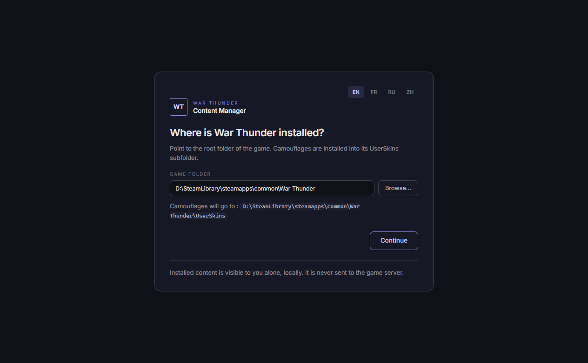
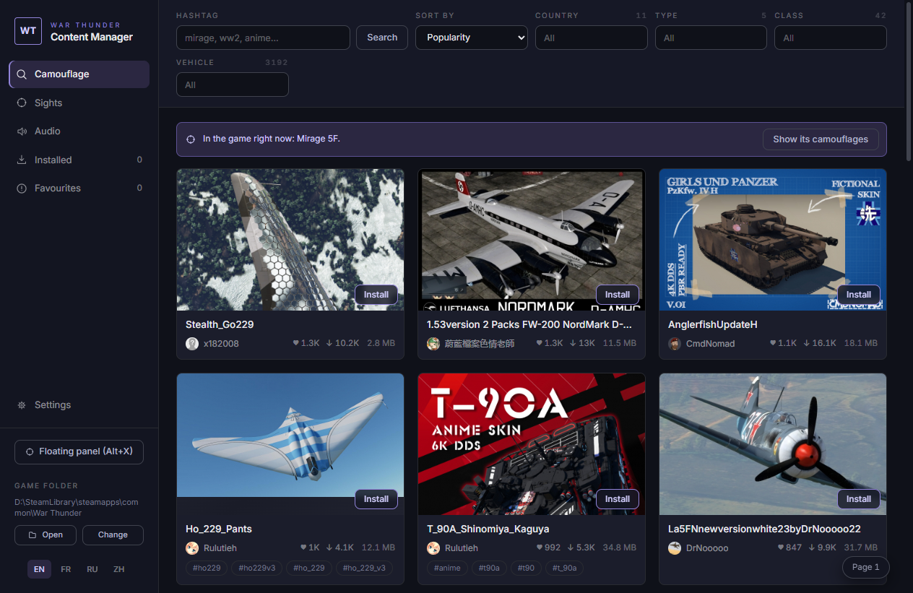
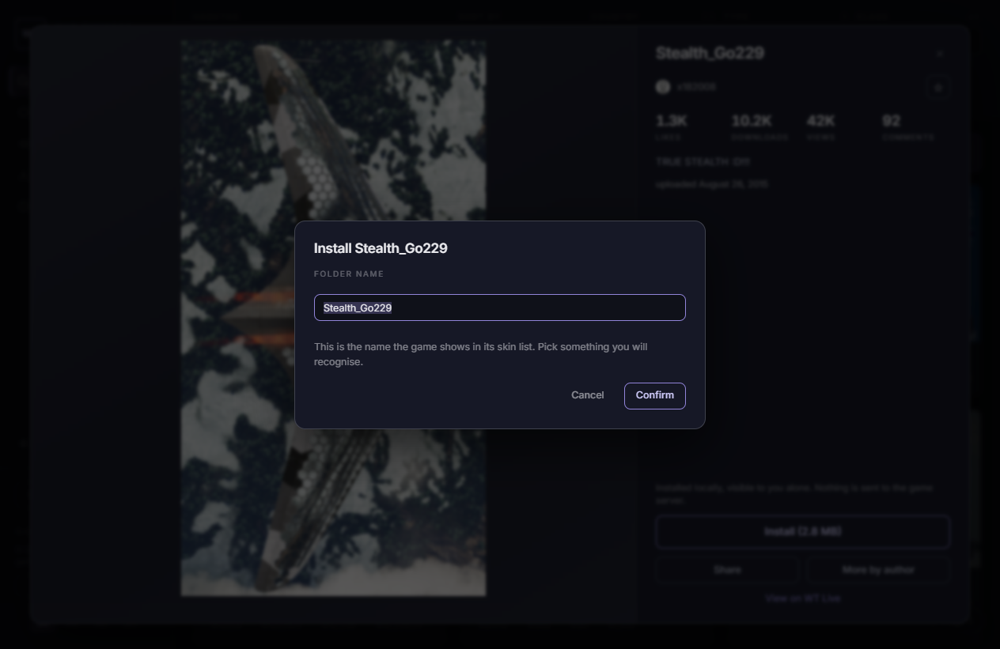
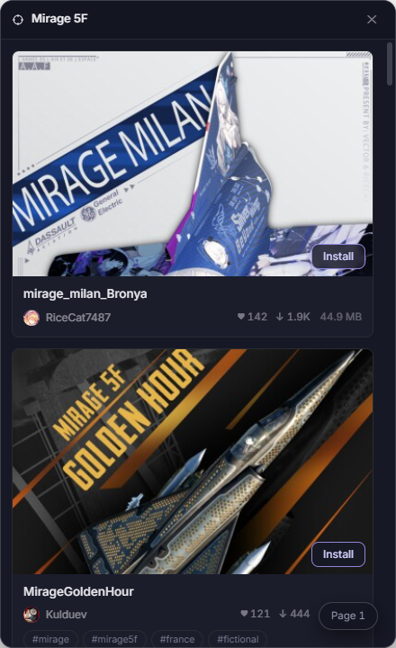

# War Thunder Content Manager

[](https://github.com/NicolasJory/war-thunder-content-manager/releases/latest)
[](LICENSE)

Browse the camouflages, gun sights and audio mods published on [War Thunder Live](https://live.warthunder.com) and install them into the game with one click.

Doing this by hand means downloading an archive, unzipping it, and dropping the folder in the right place inside your game files. Audio mods add a fourth step, a line in `config.blk` without which the game ignores them. The app does all of it, and takes back out whatever it put in.

## Features

- Infinite-scrolling catalogue, filtered by country, type, class and vehicle
- Hashtag search, plus the four sort orders the site offers
- Detail sheet with a zoomable gallery, stats and description
- One-click install, and you choose the folder name the game will show
- Tracks what you installed and flags content republished since
- Author favourites, with a feed of what they published last, plus shareable links that open straight in the app
- Camouflages, gun sights and audio mods, switched from the sidebar
- A panel you open over the game on a shortcut, already on the vehicle you have selected
- Interface in English, French, Russian and Simplified Chinese

The app finds your Steam installation on first launch. It never touches folders it did not create: Gaijin's templates and camouflages you placed by hand stay untouched, and appear read-only.

### Audio mods

A downloaded mod is either in the game or set aside with its archive kept, so putting it back costs no second download. Uninstalling deletes the audio files and the archive together, and says so first if the mod happens to be in the game.

Most archives carry more than you want. A pack may hold English and Russian crew voices, or engine sounds next to gun sounds you would rather leave stock. The app reads the archive layout before extracting anything and asks which parts go in.

The game reads `sound/mod` flat, one file per name, so two mods shipping the same name compete for it. The mixer gives each name a row showing which mod fills it and which others could. You choose row by row, or hand a row back to the game.

### The panel over the game

Press Alt+X in the hangar and a panel opens above War Thunder, on the camouflages for the vehicle you have selected. Install from there without leaving the game. Change the shortcut under Settings.

Nothing is injected into War Thunder, no memory is read and no graphics call is hooked. The panel is an ordinary window placed on top, and it learns the selected vehicle from the local HTTP interface Gaijin publishes for third-party tools, the one map and telemetry apps already use. That is the extent of the contact with a process BattlEye watches.

Closing the main window sends the app to the notification area instead of quitting, which keeps the panel one keystroke away. Quit from its tray menu.

## Install

Two builds, same app. Both keep their settings in the same place, so you can switch between them.

| | Installer | Portable |
|---|---|---|
| File | `...-Setup.exe` | `...-Portable.exe` |
| Installs to | Folder of your choice | Nothing installed |
| Desktop shortcut | Yes | No |
| `wtcm://` links open the app | Yes | No |
| Auto-updates | Yes | No, download the new version |
| First launch | Fast | A few seconds slower, it unpacks itself |

Take the installer unless you have a reason not to. The portable build suits a USB stick or a machine where you would rather not install anything.

**[Download the latest release](https://github.com/NicolasJory/war-thunder-content-manager/releases/latest)**, or build either one yourself with `npm run dist`.

### What Windows will tell you the first time

The binaries carry no code signature. A certificate runs several hundred euros a year, which makes no sense for a free tool. Two consequences follow.

**Windows shows "Windows protected your PC".** Click "More info", then "Run anyway".

**Your antivirus may complain.** An unsigned Electron app that writes into a game folder and makes network requests ticks several boxes on a suspicious profile. Every line of the code sits in this repository, and you can build it yourself if you would rather.

## Getting started

### 1. Point it at the game



The first launch asks where War Thunder lives. If you installed through Steam the field is already filled in, so check it and press Continue. Change it later from the bottom of the sidebar.

### 2. Find something



The sidebar chooses what you browse, camouflages or sights or audio. Narrow it by country, type, class and vehicle, or search a hashtag. The banner across the top names the vehicle you have selected in game and takes you to camouflages made for it.

### 3. Install it



Open a card and press Install. The app asks for a folder name, and that name is the one War Thunder shows in its own list, so pick something you will recognise. From there it downloads the archive, unpacks it and writes the files where the game reads them.

### 4. Switch it on in the game

The app puts the files in place. War Thunder still needs you to pick them.

**Camouflages.** Select your vehicle in the hangar and open Customization. Your install sits in the custom camouflage drop-down under the name you gave it. If it has not shown up, press **Update custom camouflage list**, which rereads the folder without closing the game.

**Sights.** Options, then Main Parameters, then Ground Vehicle Battle Settings, then **Sight Settings**. Choose yours from the Reticle list and Save. Alt+F9 reloads sights while you sit in a test drive.

**Audio mods.** Restart the game. War Thunder loads its sound banks once, at startup, so a mod switched on mid-session reaches your ears on the next launch.

### 5. The panel, while you play



Press Alt+X in the hangar. A panel opens over the game on the camouflages for the vehicle you are sitting in, and you install from there without going back to the desktop. It needs windowed fullscreen. The shortcut is yours to change under Settings.

### Taking it back out

The Installed tab lists what the app put in place, grouped by type, with a name filter. Uninstalling removes the files it wrote and leaves everything else alone. An audio mod has a middle setting: Deactivate takes it out of the game but keeps its archive, so putting it back costs no second download.

## What the app does with your data

Nothing leaves your machine. There is no account, no telemetry and no server in between: the app talks to War Thunder Live directly. It writes camouflages into your game's `UserSkins` folder, and sights into `Documents\My Games\WarThunder\Saves\<your account>\production\UserSights`, which is where the game reads them from. Audio mods go into `sound\mod` inside the game folder, and the app writes `enable_mod:b=yes` into `config.blk` so the game loads them, taking that line back out when the last mod leaves.

While the game runs, the app asks `http://127.0.0.1:8111` which vehicle you have selected. That server is War Thunder's own, it answers on your machine alone, and the app only reads from it.

Installed content is visible to you alone, locally. The game server never sees it.

Your settings live in one file, next to the app's configuration folder:

```
%APPDATA%\War Thunder Content Manager\config.json
```

## Development

You need Node.js 20 or newer.

```bash
npm install
npm run dev
```

### Commands

| Command | What it does |
|---|---|
| `npm run dev` | Runs the app with hot reload |
| `npm run build` | Type-checks and builds all three processes |
| `npm run typecheck` | Types only |
| `npm run dist` | Builds both the installer and the portable exe into `release/` |
| `npm run smoke` | Real install: downloads two actual archives into a test folder |
| `npm run smoke:real` | Same, against your real game folder, checking it comes back untouched |
| `npm run smoke:ui` | Filters, translations, description parsing |
| `npm run smoke:validate` | IPC boundary validation, incoming links, endpoint manifest |
| `npm run smoke:sight` | Sight install against your real sights folder |
| `npm run smoke:sight-overwrite` | Reticles shared between sight packs |
| `npm run smoke:config` | Steam detection, persistence |
| `npm run smoke:network` | Retries, timeouts and backoff, against a local failing server |
| `npm run smoke:sound` | Classifying an audio archive's layout, on four real ones, and patching `config.blk` |
| `npm run smoke:sound-install` | Install, activate and uninstall against a fake game folder |
| `npm run smoke:sound-slots` | The mixer: which mod fills which audio file |
| `npm run smoke:vehicle` | Reading the selected vehicle from the game and from the profile |
| `npm run smoke:shortcut` | Shortcut capture, and what it turns down |
| `npm run smoke:backdrop` | When a modal closes and when it must not |

The tests hit the live API and download real archives. They are slow and depend on the network, on purpose: a suite that only talks to mocks would never notice the API changing under it.

### Layout

```
src/
  main/       Electron main process: network, install, filesystem
  preload/    contextBridge, the only surface the renderer sees
  renderer/   React interface
  shared/     Pure modules used by both sides
```

The renderer reaches neither the network nor the filesystem. Everything goes through named IPC channels whose arguments are validated on arrival.

### When the Live API moves

These endpoints are unofficial. They all live in `src/shared/endpoints.ts`: addresses, headers, the pattern that extracts the filter taxonomy, allowed download hosts and safety limits. No URL is hard-coded anywhere else.

You can override any part of the manifest without recompiling. Drop a file next to your configuration:

```
%APPDATA%\War Thunder Content Manager\endpoints.json
```

```json
{
  "api": { "feed": "/api/v2/feed/" },
  "downloadHosts": ["cdn2.warthunder.com"]
}
```

The app also reads [`endpoints.json`](endpoints.json) from this repository at startup, which means one commit repairs every user on their next launch, with no release to publish. Your local file wins over the published one.

Each field is validated on its own. A half-wrong file keeps the defaults for whatever fails, rather than breaking the app.

## Known limits

**A `https://live.warthunder.com` link someone sends you on Discord opens your browser.** Windows reserves web link handling for the default browser. Two ways around it: links shared from the app use a custom protocol that opens it directly, and pasting a Live URL into the search field opens that content in the app.

**Vehicle filter values stay in English** across all four languages. They come from the API, over a taxonomy of more than 3,000 entries that shifts with every game update.

**Audio mods only reach your ears on the next launch.** War Thunder loads its sound banks once, at startup. Change a mod mid-session and you will hear it after you restart the game.

**The panel needs windowed fullscreen.** In exclusive fullscreen Windows hands the whole surface to the game, and nothing draws above it.

**Some sight archives get turned down.** The app reads the archive layout by matching folder names against Live's vehicle taxonomy, which covers every pack tested so far. An archive laid out some other way is refused rather than guessed at: a sight dropped in the wrong folder never shows up in game, and you would have no way to tell why.

## Contributing

Issues and pull requests are welcome. Before opening a PR, run `npm run typecheck` and the test suites that apply to what you touched.

Source comments are in French. Nothing else is: user-facing strings live in `src/renderer/src/i18n.ts`, and adding a language means adding one dictionary there. TypeScript will list every key you missed.

## License

[GPL-3.0](LICENSE).

The Inter typeface ships under the [SIL Open Font License 1.1](https://github.com/rsms/inter/blob/master/LICENSE.txt).

The icon font that draws the national roundels belongs to Gaijin Entertainment. This repository does not redistribute it: the app fetches it from their server on first launch, the same way a browser would.

This project is neither affiliated with nor endorsed by Gaijin Entertainment. War Thunder and War Thunder Live are their trademarks.
